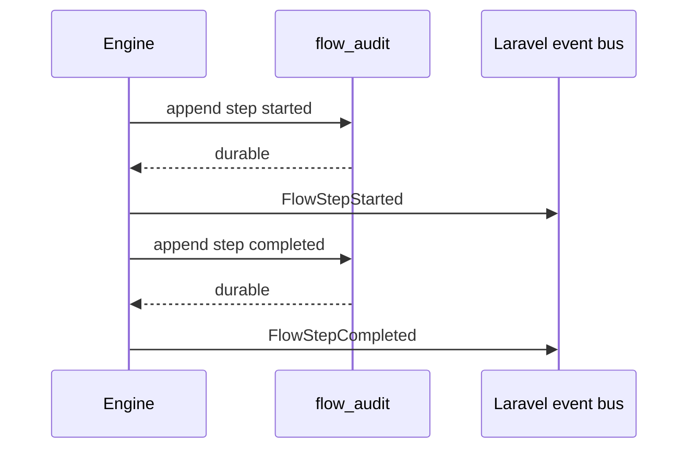

# Events and Audit

When `audit_trail_enabled` is true, laravel-flow dispatches lifecycle events for step and compensation transitions. With persistence enabled, audit rows are appended for non-dry-run executions.

::: callout info "Failure behavior" icon:alert-circle
Normal step listener or persistence failures are surfaced after best-effort recovery and compensation. Compensation listener failures are swallowed after durable compensation audit so rollback is not interrupted.
:::

## Event classes

Core event classes include `FlowStepStarted`, `FlowStepCompleted`, `FlowStepFailed`, `FlowCompensated`, and `FlowPaused`.
