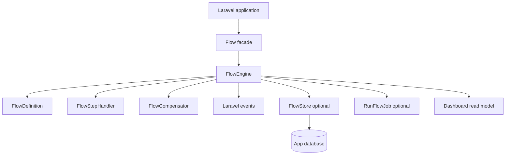

# Architecture Overview

laravel-flow has a small core with optional infrastructure adapters.

::: callout info "Headless by design" icon:monitor
The package exposes dashboard contracts but does not embed a UI. The companion admin panel can consume those contracts separately.
:::

## Layers

- Definition layer: fluent builder and immutable step definitions.
- Execution layer: input validation, handler resolution, step execution, compensation, and run result aggregation.
- Persistence layer: repository contracts with Eloquent implementations.
- Operations layer: Artisan commands, queued jobs, approvals, webhooks, pruning, replay, and dashboard DTOs.
