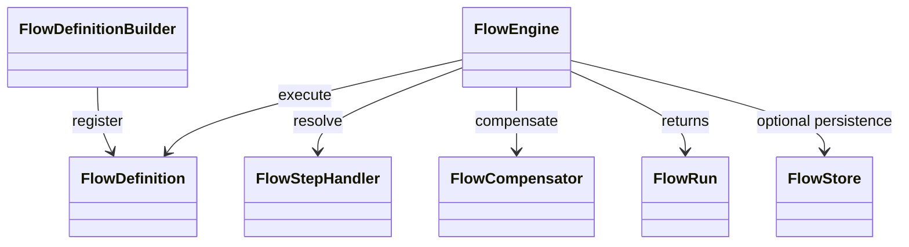

# Design

Il design favorisce classi risolte dal container, run piccoli, persistenza opt-in e confini espliciti tra API pubblica e dettagli interni.

::: tabs
### Default

Synchronous, in-memory, container-resolved. Good for local orchestration and tests.

### Persisted

Database-backed runs, steps, audit rows, approval records, and webhook outbox rows.

### Queued

`Flow::dispatch()` queues a `RunFlowJob` after commit and protects duplicate execution with cache locks.
:::

## Trade-off principale

Il motore sceglie semplicità operativa invece di una piattaforma workflow separata. Il vantaggio e che l'app resta Laravel-native; il costo e che non si ottiene la durabilita cross-service di un runtime dedicato.
