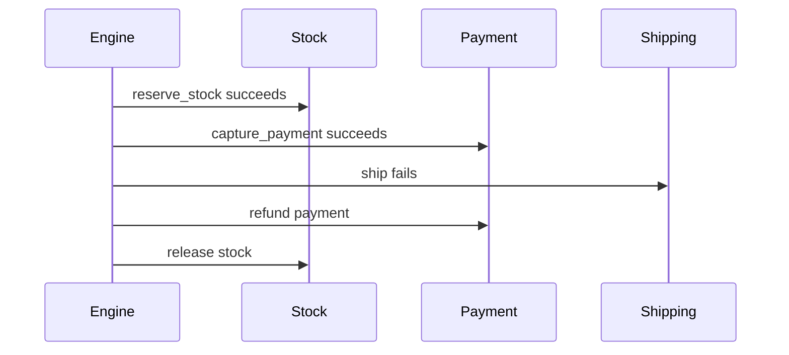

# Compensation

Compensation is saga rollback. When step `N` fails, laravel-flow walks previously completed compensatable steps from `N - 1` back to the first step and calls each `FlowCompensator`.

```php
Flow::define('order.fulfill')
    ->withInput(['order_id'])
    ->step('reserve_stock', ReserveStock::class)
        ->compensateWith(ReleaseStock::class)
    ->step('capture_payment', CapturePayment::class)
        ->compensateWith(RefundPayment::class)
    ->step('ship', CreateShipment::class)
        ->compensateWith(CancelShipment::class)
    ->register();
```



::: callout tip "Compensator design" icon:rotate-ccw
Write compensators to be idempotent. They may be called during failure recovery or manual replay scenarios.
:::
