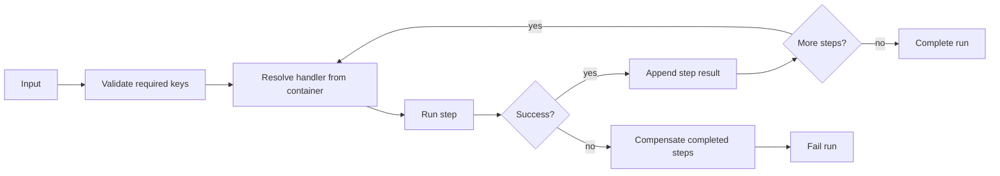

# Pipeline and Workflow

A laravel-flow run is a linear workflow pipeline. Each step receives a `FlowContext`, returns a `FlowStepResult`, and can contribute output plus business impact for downstream consumers.

::: collapsible "Pipeline invariants" open
- Step order is deterministic.
- Handlers and compensators are class-based and container-resolved.
- Dry-run execution invokes only dry-run-aware steps.
- Persistence is opt-in and skipped for dry-runs.
- Audit rows require both persistence and audit trail to be enabled.
:::

## Workflow boundaries

Keep a flow at the business transaction boundary. A handler can call lower-level services, but the flow should remain the readable operation graph.
