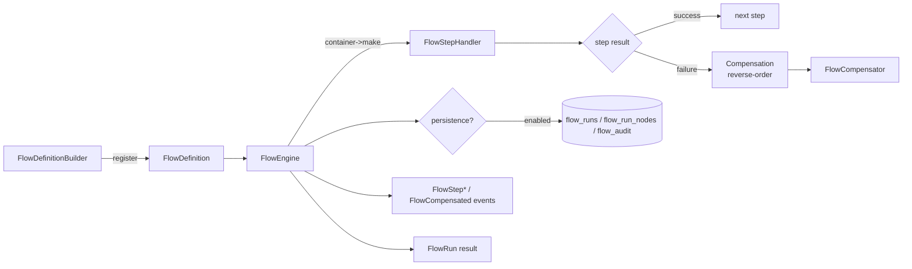

# laravel-flow


[](https://github.com/padosoft/laravel-flow/actions/workflows/ci.yml)
[](https://packagist.org/packages/padosoft/laravel-flow)
[](https://packagist.org/packages/padosoft/laravel-flow)
[](https://laravel.com)
[](https://github.com/padosoft/laravel-flow/blob/main/LICENSE)

> **laravel-flow is the saga engine Laravel never shipped.**
> Define multi-step business workflows in one fluent surface a junior dev reads in 30 seconds, then get
> native dry-run, reverse-order compensation, approval gates, signed webhook delivery and an immutable
> audit trail — synchronous and in-memory by default, with opt-in DB persistence and queues. No
> external workflow cluster, no new service to operate. It lives inside the Laravel app you already run.

::: callout info "New here? Read this page top to bottom" icon:compass
In five minutes you'll know exactly what this package is, the problem it solves, why it beats every
"just chain some jobs" alternative, and where to click next. Every other page goes deeper — this one
gives you the whole picture.
:::

---

## What it is — in one minute

Laravel apps constantly orchestrate **multi-step business workflows**: validate, simulate, write a DB
row, queue a job, call a vendor API, get a manager's sign-off. The framework gives you `Bus::chain()`
for sequence, jobs for async and `transaction()` for atomicity — but none of them ship with **dry-run**,
**reverse-order saga compensation**, **approval gates** or a **single fluent surface** that a new
teammate can read at a glance.

`laravel-flow` is that surface. You declare the flow once and the engine handles the hard parts:

- **Define readable flows** — `Flow::define()->withInput([...])->step(...)->register()` with
  container-resolved, DI'd, stack-traceable handler classes (never closures).
- **Simulate before you commit** — `Flow::dryRun()` invokes dry-run-aware steps so they can project
  business impact, skips the rest, and writes **nothing** to the database.
- **Roll back like a saga** — when step N fails, the engine walks completed steps N-1 → 1 calling each
  `compensateWith()` compensator, in reverse order by default.
- **Govern and observe** — approval gates that pause/resume/reject runs, signed webhook outbox delivery,
  an event-driven and append-only audit trail, and headless dashboard read contracts.

> **In one line:** *the DX-first workflow / saga / compensation engine for Laravel — dry-run, reverse-order
> rollback, approvals and audit, inside your own app, with zero external workflow service.*

---

## The problem it solves

Every team that outgrows "just chain the jobs" hits the same wall: no preview, no predictable rollback,
no sign-off, no audit. Here is the gap this package closes.

| Without laravel-flow | With laravel-flow |
|---|---|
| You hand-roll a separate "preview" code path so users can see impact before committing. | **Native dry-run** — `Flow::dryRun()` projects business impact and writes no run, step, audit or compensator rows. |
| Step 3 fails after steps 1 and 2 already wrote rows — and cleanup is ad-hoc, best-effort, or forgotten. | **Reverse-order saga compensation** — `compensateWith()` walks completed steps backwards, predictably, every run. |
| A manual sign-off means a bespoke "pending" table, tokens and resume logic you build and secure yourself. | **Approval gates** pause the run, issue a hashed one-time token, and `Flow::resume()` / `Flow::reject()` continue or compensate. |
| Notifying downstream systems means scattering HTTP calls and praying transient failures don't drop events. | **Signed webhook outbox** persists lifecycle rows and `flow:deliver-webhooks` retries with backoff and an HMAC signature. |
| "Who did what, when, with which inputs?" lives in scattered logs an auditor can't trust. | **Event-driven + append-only audit** — `FlowStep*` / `FlowCompensated` events plus immutable `flow_audit` rows. |
| Workflow tooling means standing up Temporal or Step Functions — a new service, cluster and on-call surface. | **Runs inside your Laravel app and DB.** In-memory by default; persistence and queues are opt-in flags. |
| Secrets leak into stored payloads and exception text. | **Configurable JSON redaction** scrubs `input/output/business_impact/payload/actor` before storage; engine error text is sanitized. |

---

## Who it's for

::: grids
  ::: grid
    ::: card "Laravel teams shipping business workflows" icon:workflow
    Order, promotion, billing, onboarding and fulfillment flows that coordinate several steps in one request or job — with DI, events and Eloquent-compatible persistence you already know.
    :::
  :::
  ::: grid
    ::: card "Products where preview is a feature" icon:flask-conical
    "Simulate this promotion / refund / migration before applying it" becomes a first-class `Flow::dryRun()` call that projects business impact and touches nothing.
    :::
  :::
  ::: grid
    ::: card "Regulated & audited operations" icon:scroll-text
    Append-only audit rows, manual approval gates, redacted payloads and signed webhooks give auditors the *who/what/when/which-inputs* trail they ask for.
    :::
  :::
  ::: grid
    ::: card "Platform & ops engineers" icon:gauge
    Headless dashboard read contracts, deny-by-default authorization, retention pruning and a companion admin UI — operate flows without bolting a workflow cluster onto your stack.
    :::
  :::
:::

---

## Why it's different — the moats

Plenty of tools cover *some* of this. None ship the whole set as one fluent, Laravel-native, self-hosted surface.

::: grids
  ::: grid
    ::: card "Dry-run is a first-class flag" icon:flask-conical
    `->withDryRun(true)` per handler. In dry mode the engine invokes dry-run-aware steps so they can project impact and self-skips the rest — no parallel "preview" code path to maintain, and zero DB writes.
    :::
  :::
  ::: grid
    ::: card "Reverse-order saga compensation" icon:rotate-ccw
    When step N fails, the engine walks completed steps N-1 → 1 calling each `FlowCompensator`. Predictable rollback every time; opt-in `parallel` batching for independent, idempotent compensators.
    :::
  :::
  ::: grid
    ::: card "Resumable approval gates" icon:user-check
    `approvalGate('manager')` pauses the run, emits `FlowPaused`, and issues a hashed one-time token. `Flow::resume()` continues from the next step; `Flow::reject()` compensates — both under a per-run lock.
    :::
  :::
  ::: grid
    ::: card "Signed webhook outbox" icon:webhook
    Lifecycle rows for `flow.completed/failed/paused/resumed` persist inside engine transactions; `flow:deliver-webhooks` signs each payload with `X-Laravel-Flow-Signature` and retries transient failures with backoff.
    :::
  :::
  ::: grid
    ::: card "Append-only, event-driven audit" icon:scroll-text
    `FlowStep*` / `FlowCompensated` events route to your logger, DB or metrics; persisted `flow_audit` rows are blocked from update/delete at runtime — `flow:prune` is the only deletion path.
    :::
  :::
  ::: grid
    ::: card "Fluent, container-resolved API" icon:braces
    `step('persist', PersistPromotion::class)` — class-based handlers get DI, type hints and real stack traces, and survive serialization on queued workers. Strict `withInput()` validation fails fast on a missing key.
    :::
  :::
  ::: grid
    ::: card "In-memory by default, persistence opt-in" icon:database
    The engine runs synchronously in memory with zero migrations. Flip `persistence.enabled` for `flow_runs`/`flow_run_nodes`/`flow_audit`, correlation/idempotency keys, idempotent run reuse and retention pruning.
    :::
  :::
  ::: grid
    ::: card "Headless dashboard contracts" icon:layout-dashboard
    `FlowDashboardReadModel` returns paginated, immutable DTOs for runs, approvals, outbox and KPIs; `DashboardActionAuthorizer` is deny-by-default. The package stays headless; a companion app builds the UI.
    :::
  :::
  ::: grid
    ::: card "v1.0 SemVer-pinned public surface" icon:shield-check
    Every class is `@api` (covered) or `@internal`; a contract test pins class names, methods and constants so a patch can't silently rename or remove the public API. Redaction scrubs secrets before storage.
    :::
  :::
:::

---

## See it: the companion admin panel

The package itself is **headless** — there is no embedded UI. A full-featured web admin panel ships
separately as [`padosoft/laravel-flow-admin`](https://github.com/padosoft/laravel-flow-admin), built on
the package's stable headless dashboard contracts (`FlowDashboardReadModel` + `DashboardActionAuthorizer`).
It surfaces runs, approvals, failures, the webhook outbox and operational KPIs.


---

## laravel-flow vs. the alternatives

| Capability | **laravel-flow** | Raw jobs / `Bus::chain()` | Symfony Workflow | Temporal / AWS Step Functions |
|---|:---:|:---:|:---:|:---:|
| Native dry-run with no persistence writes | ✅ | ❌ | ❌ | ❌ |
| Reverse-order saga compensation, built in | ✅ | ❌ | ➖ | ➖ |
| Resumable approval gate as a step type | ✅ | ❌ | ➖ | ➖ |
| Signed webhook outbox delivery | ✅ | ❌ | ❌ | ➖ |
| Container-resolved PHP handlers (DI + stack traces) | ✅ | ✅ | ✅ | ❌ |
| Append-only audit + event hooks | ✅ | ➖ | ✅ | ✅ |
| In-memory default, opt-in app-DB persistence | ✅ | ✅ | ➖ | ❌ |
| Runs inside your Laravel app, no external service | ✅ | ✅ | ✅ | ❌ |

> Legend: ✅ built-in · ➖ partial / manual / via a different model · ❌ not available.
> Snapshot checked against Durable Workflow, Symfony Workflow, Temporal and AWS Step Functions docs (2026-05-05).
> If you already run Temporal or Step Functions and need their queue/replay/redrive guarantees today, use them.

**[→ Full competitor breakdown](https://github.com/padosoft/laravel-flow#comparison-vs-alternatives)** — the README carries the detailed 20-row matrix.

---

## How it fits together

You register a `FlowDefinition` once; `Flow::execute()` (or `dryRun()` / `dispatch()`) iterates its steps
through the engine. A failure walks completed steps backwards through their compensators, and every run
resolves to a single `FlowRun` result.



Dry-runs invoke dry-run-aware steps and write nothing. When persistence is enabled, non-dry-run executions
write runs, steps and (with `audit_trail_enabled`) append-only audit rows.

---

## Start in 30 seconds

::: steps
1. **Install the package**
   ```bash
   composer require padosoft/laravel-flow
   # optional — the engine works with defaults:
   php artisan vendor:publish --tag=laravel-flow-config
   ```
   The in-memory, synchronous engine works immediately — no migrations required.

2. **Define a flow with a dry-run step and a compensator**
   ```php
   use Padosoft\LaravelFlow\Facades\Flow;

   Flow::define('promotion.create')
       ->withInput(['brand', 'discount_pct', 'starts_at', 'ends_at'])
       ->step('validate', ValidatePromotionInput::class)
       ->step('simulate', SimulatePromotionImpact::class)
           ->withDryRun(true)
       ->step('persist', PersistPromotion::class)
           ->compensateWith(ReversePromotion::class)
       ->register();
   ```

3. **Execute for real, or simulate with zero writes**
   ```php
   $run     = Flow::execute('promotion.create', $input);  // real execution
   $preview = Flow::dryRun ('promotion.create', $input);  // simulate, no DB writes

   // If a later step fails, $run->compensated === true and prior steps were rolled back.
   ```
:::

**[→ Quickstart](/get-started/quickstart)** · **[→ Installation](/get-started/installation)** · **[→ Worked Example](/guides/worked-example)**

---

## Batteries included for AI-assisted development

This repo ships **AI batteries** — a `CLAUDE.md` working guide, an `AGENTS.md` workflow contract and
invocable `.claude/skills/` encoding the TDD loop, the Copilot review loop, the docs-sync discipline and
the package coding rules. Open the package in Claude Code, Cursor, Copilot or Codex and your agent
already knows the house rules. The pack is opt-in: delete `.claude/` if you don't use it — nothing else
depends on it.

---

## Where to go next

::: grids
  ::: grid
    ::: card "Quickstart" icon:zap
    Install, define your first flow, and run a dry-run in minutes. **[Open →](/get-started/quickstart)**
    :::
  :::
  ::: grid
    ::: card "Compensation" icon:rotate-ccw
    How reverse-order saga rollback works, and when to opt into parallel compensation. **[Read →](/guides/compensation)**
    :::
  :::
  ::: grid
    ::: card "Architecture" icon:boxes
    The engine, the data contract, persistence, events/audit and the ADRs behind the design. **[Explore →](/architettura/overview)**
    :::
  :::
:::

::: callout tip "Package facts" icon:info
Composer `padosoft/laravel-flow` · PHP `^8.3` (8.3/8.4) · Laravel `13.x` · Apache-2.0 ·
[GitHub](https://github.com/padosoft/laravel-flow) · [Packagist](https://packagist.org/packages/padosoft/laravel-flow)
:::
